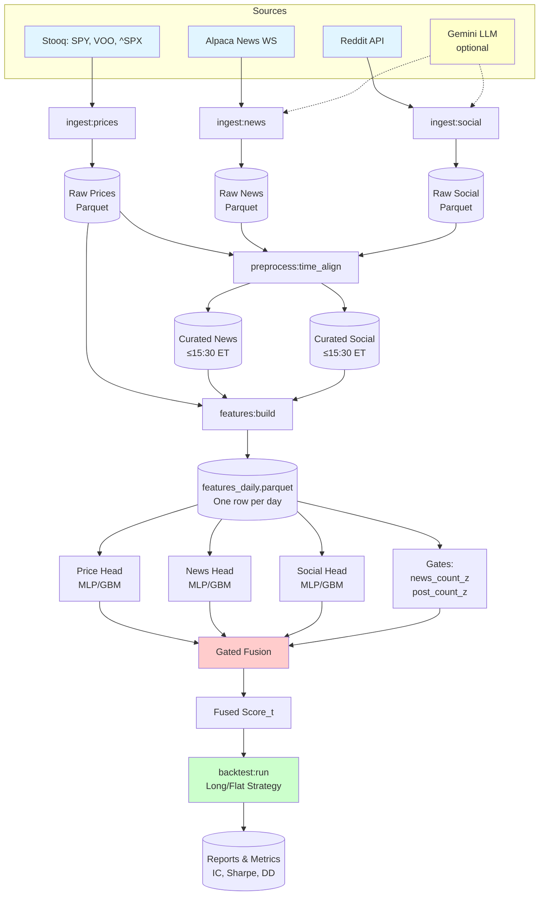

# ORBIT — System Diagram

*Last edited: 2025-11-06*

## Mermaid Flowchart



---

## ASCII Art Diagram

```
                 ┌────────────────────────────────────────────────┐
                 │                    Sources                     │
                 │  Stooq (SPY/VOO/^SPX)  Alpaca News WS  Reddit │
                 │                 (Gemini LLM optional)         │
                 └───────────────┬──────────────┬─────────────────┘
                                 │              │
                        ingest:prices   ingest:news   ingest:social
                                 │              │
                                 ▼              ▼
                          ┌────────────┐  ┌────────────┐
                          │  Raw Lake  │  │  Raw Lake  │  (Parquet)
                          │  prices/   │  │  news/     │  + run_id
                          │            │  │            │
                          └──────┬─────┘  └──────┬─────┘
                                 │              │
                                 └──────┬───────┘
                                        │  preprocess:* (time align, dedupe, mapping, lags)
                                        ▼
                                  ┌───────────────┐
                                  │  Curated      │  curated/news, curated/social
                                  │  text tables  │  (cutoff ≤ 15:30 ET)
                                  └──────┬────────┘
                                         │
                                         ▼
                                 ┌──────────────────┐
                                 │  features:build │  (daily row)
                                 │  price/news/social
                                 └──────┬────────────┘
                                        │
             ┌──────────────────────────┼──────────────────────────┐
             ▼                          ▼                          ▼
      price_head                   news_head                   social_head
       (MLP/GBM)                   (MLP/GBM)                   (MLP/GBM)
             └──────────────┬──────────┴──────────┬──────────────┘
                            ▼                     ▼
                     gates from intensity    gates from buzz
                      (news_count_z,         (post_count_z,
                        novelty)                novelty)
                            └──────────────┬──────────────┘
                                           ▼
                                 ┌───────────────────┐
                                 │  gated fusion     │  Score_t
                                 └─────────┬─────────┘
                                           │
                                 ┌─────────▼─────────┐
                                 │  backtest:run     │  long/flat
                                 └─────────┬─────────┘
                                           │
                              ┌────────────▼────────────┐
                              │  reports/  & metrics    │
                              └─────────────────────────┘
```

## Components

* **Sources**: Stooq CSV (SPY.US, VOO.US, ^SPX), Alpaca News WS (≤30 symbols), Reddit API (+ optional Gemini for escalated posts).
* **Ingestion jobs**: `ingest:prices`, `ingest:news`, `ingest:social` → append‑only Parquet with `run_id`, `ingested_at`.
* **Preprocess**: time alignment to ET, 15:30 ET cutoff, dedupe clustering (text), mapping rules.
* **Features**: one **daily** row combining price, news, social + standardized z‑scores (rolling windows).
* **Model heads**: three tiny models producing scalar scores.
* **Gated fusion**: learnable weights; gates driven by text **intensity/novelty**.
* **Backtest**: long/flat with costs; ablations and regime analysis.
* **Artifacts**: `data/` (raw/curated/features), `models/`, `reports/`.

## Schedules & Ordering (daily)

1. After close (T): run `ingest:prices` (Stooq).
2. Throughout T: `ingest:news` (WS capture) & `ingest:social` (batch pulls).
3. At **15:30 ET** cutoff: freeze T text; run `preprocess:*`.
4. Run `features:build` for day T.
5. Train/score in walk‑forward batch; produce Score_T.
6. `backtest:run` with Score_T → simulated trade next session.

## Anti‑leak guardrails

* Only include text **published ≤ 15:30 ET** on day T.
* Apply publish‑time lags (e.g., 15–30 min) during training.
* No revised data; store raw ingests with timestamps and source ids.

## Failure handling

* Missing text data on T ⇒ compute price features only; set gates low; **flatten** signal in backtest for that day.
* WS disconnects ⇒ exponential backoff + resume from last `published_at`.

## Acceptance checklist

* Diagram includes sources→ingest→preprocess→features→heads→fusion→backtest.
* Cutoff and lag rules are explicitly shown.
* Daily ordering is unambiguous.
* Failure mode and fallback behavior are defined.

---

## Related Files

* `02-architecture/dataflow.md` — Detailed data flows
* `02-architecture/modules_inventory.md` — Module catalog
* `05-ingestion/scheduler_jobs.md` — Job execution order
